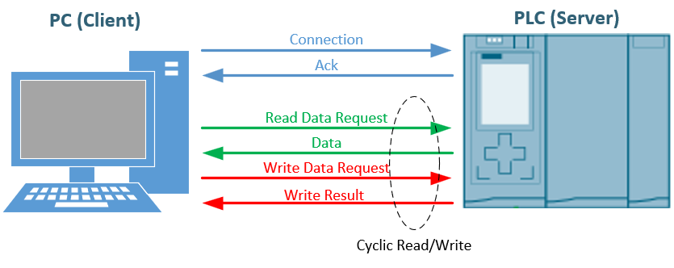
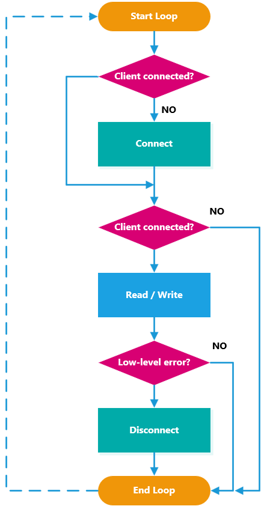

# Rust7 manual
## Background

This project is directly derived from <a href="https://github.com/davenardella/snap7" target="_blank">Snap7</a>. For more information on data formatting (endianess), PLC areas, etc., I recommend referring to the original project documentation, available into /doc folder.

---
## Briefly
Communication with Siemens PLCs via the S7 protocovl occurs according to the classic client-server model, in which the PC is the client and the PLC is the server.

The mechanism is quite simple: to read or write data to a PLC, you must first connect to it and then send a read request, after which you will receive the data, or a write request containing the data to be written.
In both cases, you will receive a response containing the outcome of the operation.



### Connection
The S7 protocol is encapsulated in TCP/IP, so the connection must first follow TCP/IP rules, meaning it must contain the IP address and port.
In reality, there are other parameters, such as Rack and Slot or TSAP records, but there are support methods that hide these details.


There are four connection methods available:

* `connect_s71200_1500()` 
* `connect_s7300()` 
* `connect_rack_slot()`
* `connect_tsap()`

The first two are fairly self-explanatory; the third is for use with **S7400**, **WinAC**, and **Sinamics**; the rack and slot parameters will be copied from the project's hardware configuration.
The fourth is for use with **LOGO!** or **S7200** only.
We'll explore these in detail in the API. 

---

### Workflow

**First consideration:**

The connection process is quite complex, and the PLC is not a web server, so the connection must be kept active at all times.

**Second consideration:**

There is no such thing as problem-free communication, and this case is no exception. The library reports two categories of errors: low-level errors such as TCP, corrupt headers due to fragmented packets, etc., and high-level errors, such as a read request from a non-existent database.
In the first case, it is **strongly recommended** to disconnect from the PLC and reconnect before performing any other operations. This behavior is the same as that adopted by WinCC and all other SCADA programs.

**Third consideration:**

Your software will almost certainly have a thread-loop for reading and writing data ciclically, and you'll also have to handle communication errors, such as a physical disconnection of the network cable, without reporting errors, pop-ups, or clogging the system with exceptions to handle.  
But above all, the software must be **pass-through** (non-blocking)

What should we do?

Over the years, this is the question I've been asked most frequently.
So I'll show you a workflow that's the same one we use (not just with Snap7).

First, since low-level error handling involves disconnecting and connecting, these two methods will become part of our loop. When we initialize the program, we'll simply create the Client object and optionally preset the connection (set a port other than 102, set timeouts, etc.).




A very simplistic pseudo-code would be this:

```rust
while !exit_request{
    
    if !Client.connected {
        let _ = client.connect_s71200_1500(ip_address);
    }
    
    if Client.connected {
        if !do_read_and_write() { // <-- returns false when severe error occurs
            Client.disconnect();
        }
    }

    thread::sleep(100);
}
```

# API
---

#### Connection Setup


|Prototype|Behaviour|      
|---|---|
|`set_connection_type`|Changes the S7 connection type to the PLC       |
|`set_timeout`        |Sets operations timeout                         |
|`set_connection_port`|Sets the TCP Connection Port                    |

#### Connection
|Prototype|Behaviour|      
|---|---|
|`connect_s71200_1500`|Connects to the S71200 or S71500 families            |
|`connect_s7300`      |Connects to S7300 family                             |
|`connect_rack_slot`  |Connects to a Siemens PLC/Drive using Rack and Slot  |
|`connect_tsap`       |Connects to a Siemens ISO-Hardware using TSAP records|
|`disconnect`         |Closes the connection                                |

#### Raw Read/Write methods
|Prototype|Behaviour|      
|---|---|
|`read_area`     |Reads a block of data from a specific S7 memory area  |
|`write_area`    |Writes a block of data to a specific S7 memory area   |

#### Simplified Read/Write methods
|Prototype|Behaviour|      
|---|---|
|`read_db`       |Reads a block of byte from a specific Data Block (DB) |
|`read_bit`      |Reads a bit from a specific S7 memory area            |
|`write_db`      |Writes a block of byte to a specific Data Block (DB)  |
|`write_bit`     |Writes a bit to a specific S7 memory area             |

## Connection setup methods
---

```rust
pub fn set_connection_type(&mut self, connection_type: u16)
```
### Changes the S7 connection type to the PLC

The three possible connection types are:
- `CT_PG`: (as a programming device)
- `CT_OP`: (as an HMI)
- `CT_S7`: (as a generic device)

In practice, there aren't many differences; the CT_PG connection should ensure
better system responsiveness, but in reality, I've never noticed any noticeable differences.

`CT_PG` is used by default.

With very old PLCs (early S7300 series) that have limited communication resources,
the connection may be rejected if we have S7Manager with many online windows open at the same time.  
In this case, use `CT_OP` or `CT_S7`. 
 
#### Parameters
- `connection_type`: Connection type.

#### Notes
1. The client must not be connected (that is, call this method before connecting).
2. This method is not useful if you use `connect_tsap()` because the connection_type is already contained in the REMOTE_TSAP record.

---

```rust
pub fn set_timeout(&mut self, co_timeout_ms: u64, rd_timeout_ms: u64, wr_timeout_ms: u64 )
```
### Sets operations timeout

#### Parameters
- `co_timeout_ms` : TCP Connection timeout (ms) (Default = 3000 ms)
- `rd_timeout_ms` : Read Connection timeout (ms) (Default = 1000 ms)
- `wr_timeout_ms` : Write Connection timeout (ms) (Default = 500 ms)

 
#### Notes
1. Values must be > 0, otherwise they are ignored
2. The client must not be connected (that is, call this method before connecting).

---
```rust
pub fn set_connection_port(&mut self, port: u16)
```
### Sets the TCP Connection Port
The default S7 Port is 102, but if you need NAT the addresses you can use this method to change the default value.

### Parameters
- `port`: TCP Connection port (1..65535)

### Notes
1. Value must be > 0, otherwise it is ignored
2. The client must not be connected (that is, call this method before connecting).

---
## Connection methods
---

```rust
pub fn connect_s71200_1500(&mut self, ip: &str) -> Result<(), S7Error>
```
### Connects to the S71200 or S71500 families   

This helper method is same as `connect_rack_slot()` with rack=0 and slot=0
### Parameters
- `ip`  : PLC IPV4 address.
 
For Notes, Return and Errors look at `connect_tsap()`

---
```rust
pub fn connect_s7300(&mut self, ip: &str) -> Result<(), S7Error>
```
### Connects to S7300 family

This helper method is same as `connect_rack_slot()` with rack=0 and slot=2
### Parameters
- `ip`  : PLC IPV4 address.
 
For Notes, Return and Errors look at `connect_tsap()`

---
```rust
pub fn connect_rack_slot(&mut self, ip: &str, rack: u16, slot: u16) -> Result<()
```
### Connects to a Siemens PLC/Drive using Rack and Slot
Rack and Slot are Hardware configuration parameters.

For S7300 and S71200/1500 they are fixed, (see `connect_s7300()` and `connect_s71200_1500()` ).
 
Ultimately, you will need of this method only to connect to S7400, WinAC or other Siemens hardware, like Drives, in which Rack and Slot can vary.
 
### Parameters
- `ip` : PLC IPV4 address.
- `rack` : CPU/CU Rack.
- `slot` : CPU/CU Slot.

For Notes, Return and Errors look at `connect_tsap()`

---
```rust
pub fn connect_tsap(&mut self, ip: &str, local_tsap: u16, remote_tsap: u16) -> Result<(), S7Error>
```
### Connects to a Siemens ISO-Hardware using TSAP records

This is the deepest connection method, you will need it only to connect to LOGO! or S7200.

It's internally called by all other connection methods.
#### Parameters
- `ip` : PLC IPV4 address.
- `local_tsap` : Client TSAP.
- `remote_tsap` : Server TSAP (PLC).
 
#### Notes
The connection port used is 102 (S7Protocol Port) unless you
changed it via `set_connection_port()`

#### Returns
`Ok(())` on success, or an `S7Error` on failure.

#### Errors
- `S7Error::TcpConnectionFailed`: TCP connection could not be established.
- `S7Error::IsoConnectionFailed`: ISO connection failed
- `S7Error::PduNegotiationFailed`: PDU negotiation failed.
- `S7Error::Io`: network I/O error.

Example of using TSAPs (from Snap7 manual)


---
## Raw Read/Write methods
---

```rust
pub fn read_area(&mut self, area: u8, db_number: u16, start: u16, wordlen: u8, buffer: &mut [u8]) -> Result<(), S7Error>
```
### Reads a block of data from a specific S7 memory area.

#### Parameters
- `area`: S7 memory area constant (e.g., `S7_AREA_PE`, `S7_AREA_PA`, `S7_AREA_DB`, `S7_AREA_MK`).
- `db_number`: DB number (ignored for non-DB areas).
- `start`: Starting element index (byte index for bytes, bit index for bits).
- `wordlen`: Word length constant (e.g., `S7_WL_BYTE`, `S7_WL_BIT`).
- `buffer`: Destination buffer to store the read data.

#### Values
##### area
- `S7_AREA_PE` (0x81): Process Inputs
- `S7_AREA_PA` (0x84): Process Outputs
- `S7_AREA_MK` (0x84): Merkers
- `S7_AREA_DB` (0x84): Data Block
##### wordlen 
- `S7_WL_BIT` (0x01) : Bit access
- `S7_WL_BYTE` (0x02): Byte access
#### Bit access notes
1. The start must be expressed in bits.
For example, if you want to access bit `DBX 45.3`, the start value would be 45 * 8 + 3 = 363.
2. Whatever buffer is passed, only the first byte will be used, which is considered true if !=0 or false if ==0

#### Returns
`Ok(())` Operation succeeded.

#### Errors
##### Low level
- `S7Error::NotConnected`: An attempt was made to read while the client was not connected.
- `S7Error::IsoInvalidHeader`: Invalid ISO Header
- `S7Error::IsoInvalidTelegram`: Inconsistent expected telegram length.
- `S7Error::IsoFragmentedPacket`: ISO Packet fragmented.
- `S7Error::S7Unspecified`: Unknown S7 Error.
- `S7Error::Io`: network I/O error.

##### Suggestion
In case of a low-level error, it is **highly recommended** to disconnect and reconnect the Client (as WinCC or other SCADA do)
  
##### High level
- `S7Error::NotFound`: The resource was not found (e.g. Inexistent DB).
- `S7Error::S7InvalidAddress`:
1. Attempt to read beyond the limits.
2. The DB is optimized.

#### Notes
- The number of bytes to read will be equal to the size of the buffer passed.
- Large blocks are automatically split into chunks based on the negotiated PDU size.
- In case of error the buffer contents will be inconsistent and should not be considered.
 
---
```rust
pub fn write_area(&mut self, area: u8, db_number: u16, start: u16, wordlen: u8, data: &[u8]) -> Result<(), S7Error>
```
 
### Writes a block of data to a specific S7 memory area.

#### Parameters
 - `area`: S7 memory area constant (e.g., `S7_AREA_PE`, `S7_AREA_PA`, `S7_AREA_DB`, `S7_AREA_MK`).
 - `db_number`: DB number (ignored for non-DB areas).
 - `start`: Starting element index (byte index for bytes, bit index for bits).
 - `wordlen`: Word length constant (e.g., `S7_WL_BYTE`, `S7_WL_BIT`).
 - `buffer`: Source buffer to write.

#### Values
##### area
- `S7_AREA_PE` (0x81): Process Inputs
- `S7_AREA_PA` (0x84): Process Outputs
- `S7_AREA_MK` (0x84): Merkers
- `S7_AREA_DB` (0x84): Data Block
##### wordlen 
- `S7_WL_BIT` (0x01) : Bit access
- `S7_WL_BYTE` (0x02): Byte access
##### Bit access notes
1. The start must be expressed in bits.
For example, if you want to access bit `DBX 45.3`, the start value would be 45 * 8 + 3 = 363.
2. Whatever buffer is passed, only the first byte will be used, which is considered true if !=0 or false if ==0
3. Writing a bit affects **only that bit**, leaving adjacent bits in the byte unchanged. 

#### Returns
`Ok(())` Operation succeeded.

#### Errors
##### Low level
- `S7Error::NotConnected`: An attempt was made to write while the client was not connected.
- `S7Error::IsoInvalidHeader`: Invalid ISO Header
- `S7Error::IsoInvalidTelegram`: Inconsistent expected telegram length.
- `S7Error::IsoFragmentedPacket`: ISO Packet fragmented.
- `S7Error::S7Unspecified`: Unknown S7 Error.
- `S7Error::Io`: network I/O error.

##### Suggestion
In case of a low-level error, it is **highly recommended** to disconnect and reconnect the Client (as WinCC or other SCADA do)

##### High level
- `S7Error::NotFound`: The resource was not found (e.g. Inexistent DB).
- `S7Error::S7InvalidAddress`:
1. Attempt to write beyond the limits.
2. The DB is optimized.

#### Notes
- The number of bytes to write will be equal to the size of the buffer passed.
- Large blocks are automatically split into chunks based on the negotiated PDU size.
- Writing the output buffer (`S7_AREA_PA`) usually does not produce useful results, in fact the output process image will be rewritten by OB1 in the next round

---
## Simplified Read/Write methods
---

```rust
pub fn read_db(&mut self, db_number: u16, start: u16, buffer: &mut [u8]) -> Result<(), S7Error>
```
#### Reads a block of byte from a specific Data Block (DB)

This helper method is same as `read_area()` with:
- area = `S7_AREA_DB`
- wordlen = `S7_WL_BYTE`

#### Parameters
- `db_number`: DB number 
- `start`: Starting byte index 
- `buffer`: Destination buffer to store the read data.

#### Notes
- The number of bytes to read will be equal to the size of the buffer passed.
 
For further info, please refer to `read_area()`

---
```rust
pub fn write_db(&mut self, db_number: u16, start: u16, buffer: &[u8]) -> Result<(), S7Error>
```
#### Writes a block of byte to a specific Data Block (DB)

This helper method is same as `write_area()` with:
- area = `S7_AREA_DB`
- wordlen = `S7_WL_BYTE`

#### Parameters
- `db_number`: DB number 
- `start`: Starting byte index 
- `buffer`: Source buffer to write.

#### Notes
- The number of bytes to write will be equal to the size of the buffer passed.
 
For further info, please refer to `write_area()`

---
```rust
pub fn read_bit(&mut self, area: u8, db_number: u16, byte_num: u16, bit_idx: u8) -> Result<bool, S7Error>
```
 #### Reads a bit from a specific S7 memory area

 This helper method is same as `read_area()` with:
 - wordlen = `S7_WL_BIT`
 - start = `byte_num * 8 + bit_idx`
 
 #### Parameters
 - `area`: S7 memory area constant (e.g., `S7_AREA_PE`, `S7_AREA_PA`, `S7_AREA_DB`, `S7_AREA_MK`).
 - `db_number`: DB number (ignored for non-DB areas).
 - `byte_num`: Byte Number. 
 - `bit_idx`: Bit index inside the byte (0..7).
 
 #### Example
 To read DB10.DBX71.4 use:
 
 ```my_bit = read_bit(S7_AREA_DB, 10, 71, 4);```
 
 #### Returns
 `Ok(<bool>)` or `Err(<S7Error>)`
 
 #### Suggestion
 - Even reading a single bit requires an entire telegram.
 Since reading is non-invasive, if you need to read multiple bits 
 (more or less adjacent in the same area), I recommend reading blocks 
 of bytes and then unpacking them.
 
 For further info, please refer to `read_area()`

---
```rust
pub fn write_bit(&mut self, area: u8, db_number: u16, byte_num: u16, bit_idx: u8, value: bool) -> Result<(), S7Error>
```
#### Writes a bit to a specific S7 memory area

This helper method is same as `write_area()` with:
- wordlen = `S7_WL_BIT`
- start = `byte_num * 8 + bit_idx`

#### Parameters
- `area`: S7 memory area constant (e.g., `S7_AREA_PE`, `S7_AREA_PA`, `S7_AREA_DB`, `S7_AREA_MK`).
- `db_number`: DB number (ignored for non-DB areas).
- `byte_num`: Byte Number. 
- `bit_idx`: Bit index inside the byte (0..7).
- `value`: Value to write (true | false).

#### Example
To write **1** into DB10.DBX71.4 use:

```write_bit(S7_AREA_DB, 10, 71, 4, true);```

#### Returns
`Ok(())` Operation succeeded.

#### Notes
- Writing a bit affects only that bit, leaving adjacent bits in the byte unchanged. 

For further info, please refer to `write_area()`
 
# Fields
---

```rust
pub connected: bool
```
#### The Client is connected to the PLC
#### Note
- This is just a memory bit and doesn't reflect the actual state of the connection. For example, if you unplug the network cable, the underlying socket won't notice anything until the next read or write operation.

---
```rust
pub last_time: f64
```
#### Last operation time (ms).
#### Note
- If an error occurred the value will be 0.0

---
```rust
pub chunks:  usize
```
#### Indicates how many pieces the data to be read or written in the last operation was divided into
Maybe you need to know it only for extreme tuning
#### Note
- If an error occurred the value will be 0
